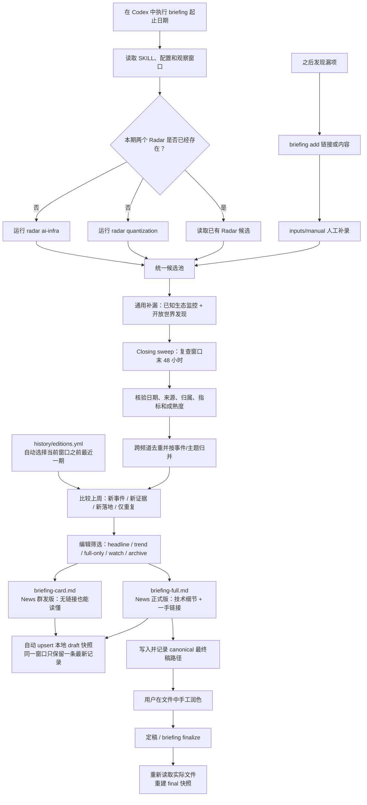

# LLM Infra Briefing

这是一个给 Codex 使用的轻量 LLM Infra 简报 skill，用来按固定知识源、频道 profile、重点 watchlist 和评分标准发现新论文、新项目、模型发布、agent 产品更新、框架 release、重要仓库 activity 和高价值技术资料，并输出周报式简报。

当前支持两个频道：

- `quantization`：LLM quantization / low-bit / compression / inference optimization，包括低 bit 量化、模型压缩、多模态/全模态模型量化、serving/runtime 集成、算子/kernel 相关工作。这里不是金融量化研究。
- `ai-infra`：LLM infrastructure，包括 serving/runtime、训练系统、MoE 系统、通信并行、kernel/operator、硬件亲和、端到端性能分析，以及会改变 compute graph、KV cache、routing、通信形态、memory traffic、training FLOPs 或 serving/training runtime 的模型架构方向。

## 工作流

- `radar <channel>`：在指定频道的固定研究范围内，按时间和来源搜索论文/项目/博客/artifact，只输出真正有价值的候选。
- `briefing <time_range>`：合并两个频道、人工补录和上一期简报，完成 closing sweep、事实复核与编辑筛选，同时生成群发版和正式版。

## 使用示例

在 Codex 中启用这个 skill 后，可以直接用自然语言触发：

```text
radar quantization 本周
radar ai-infra 过去 30 天
radar quantization 只看 KV cache compression
radar ai-infra 只查 framework releases
radar ai-infra 只看 agent products 和 repo activity
briefing 2026-07-24 2026-07-31
briefing add https://example.com/new-signal
radar ai-infra 只看模型架构对 infra 的影响
```

## Briefing 工作流



说明：已有 Radar 可以复用，但 `briefing` 仍会执行通用补漏、closing sweep、人工补录检查和上期对照；群发版与正式版共用同一份选题结果。

常规运行默认读取频道 `profile`、`watchlist`、`sources` 和 `radar-rubric`。只有在专项扫描、召回不足、分类不确定或用户要求完整覆盖时，才展开 `topics.full.yml` 和频道 research map。

如果需要保存结果，写入 `outputs/<channel>/radar/`。生成的 Markdown 报告默认不提交到 git，目录中的 `.gitkeep` 只用于保留输出路径。

最终简报写入 `outputs/briefing/<date_range>/`；用户发现的漏项写入 `inputs/manual/`，核验后进入同一候选池，不为单个实体增加硬编码保留规则。
上一期对照来自本地且不提交 Git 的 `history/editions.yml`。生成和修改 briefing 时会自动更新 draft。若你在最终 Markdown 中手工润色，执行 `briefing finalize` 会重新读取磁盘上的实际文件，再重建 final 快照，不会沿用旧草稿。

本机最终稿目录配置在同样不提交 Git 的 `local/briefing.yml`；仓库只追踪 [配置模板](templates/local-briefing-settings.yml)。


配置了 `digest_template` 的频道保存结果时，可以额外生成工作群短简报，写入对应的 `outputs/<channel>/digest/`。短简报用于每周群发，完整证据链仍保留在 `outputs/<channel>/radar/` 的 full report。

## 项目目录

```text
.
├── SKILL.md
├── workflows/
│   └── radar.md
├── config/
│   ├── channels.yml
│   ├── watchlist.yml
│   ├── channels/
│   │   ├── quantization/
│   │   │   ├── profile.yml
│   │   │   └── topics.full.yml
│   │   └── ai-infra/
│   │       ├── profile.yml
│   │       └── topics.full.yml
│   ├── sources.yml
│   ├── tracked-repos.yml
│   ├── experts.yml
│   ├── venues.yml
│   └── radar-rubric.yml
├── templates/
│   ├── radar-result.md
│   ├── radar-result-quantization.md
│   ├── radar-result-ai-infra.md
│   ├── radar-digest-quantization.md
│   └── radar-digest-ai-infra.md
├── references/
│   ├── channels/
│   │   ├── quantization-map.md
│   │   └── ai-infra-map.md
│   └── prompt-style.md
├── outputs/
│   ├── quantization/
│   └── ai-infra/
└── agents/
    └── openai.yaml
```

- `SKILL.md`：Codex skill 入口，负责触发和选择 `radar` 工作流。
- `workflows/`：核心 radar 工作流说明。
- `config/`：频道配置、固定研究范围、信息来源、专家/会议线索和 radar 初筛标准。
- `templates/`：雷达结果模板；量化和 infra 有各自的频道模板，通用模板作为 fallback。
- `references/`：频道研究地图和输出风格约束。
- `outputs/`：按频道保存实际运行后的 radar 结果。
- `agents/`：Codex UI 元数据。

## 资源消费关系

```text
channels.yml
  └─ 决定本轮 radar 使用哪个频道、轻量 profile、完整 topics、研究地图、结果模板和输出目录

sources.yml
  └─ 决定 radar 用哪些来源通道和来源组，包括 arXiv、GitHub、GitHub Releases / repo activity、Hugging Face、模型发布页、RSS、厂商博客和硬件平台 / AI factory 官方报告

tracked-repos.yml
  └─ 常规 repo release / activity 扫描时读取；维护具体 GitHub 仓库清单、频道归属、source_modes 和 runtime/operator 标签

watchlist.yml
  └─ 常规 radar 每次读取；维护“重点盯谁”，包括模型、agent 产品、机构和框架，不是 source 列表

experts.yml
  └─ 按需读取；维护作者、maintainer、实验室和研究团队，用于 query expansion、归因和信号加权，不是强制收录名单

venues.yml
  └─ 按需读取；维护会议、workshop 和 benchmark 场域，用于 query expansion 和 venue context，不是直接 source 列表

config/channels/<channel>/profile.yml
  └─ 默认读取的轻量频道画像，用于常规搜索召回、主题过滤和噪音过滤

config/channels/<channel>/topics.full.yml
  └─ 只在专项扫描、召回不足或分类不确定时读取，用于展开完整关键词和同义词

radar-rubric.yml
  └─ 被 radar 消费，用于对通过主题过滤的候选做初筛排序和动作建议

references/channels/<channel>-map.md
  └─ 只在需要解释方向、写方向观察或分类不确定时读取

templates/radar-result-<channel>.md
  └─ 决定本频道最终简报形态；量化强调量化 artifact、数据格式/压缩率/精度/落地，infra 强调模型/agent、技术报告/架构报告、系统层级/性能/扩展性/runtime/repo activity，以及 attention / MoE / residual-stream 等模型架构变化带来的 infra 影响

templates/radar-digest-ai-infra.md
  └─ 决定 AI Infra 工作群短简报形态；保留新模型 / Agent 产品、本周必看、趋势判断和可跳过项，不替代完整归档版

templates/radar-digest-quantization.md
  └─ 决定量化工作群短简报形态；保留新模型 / 量化 Artifact、本周必看、趋势判断和可跳过项，不替代完整归档版
```

简短理解：

- `channels.yml` 是路由表，决定本轮使用哪个频道。
- `config/channels/<channel>/profile.yml` 是默认入口过滤器，短、轻、省 token。
- `config/sources.yml` 是来源通道表，回答“用什么方式搜”。具体 repo 不直接维护在这里。
- `config/tracked-repos.yml` 是 GitHub 仓库表，回答“哪些 repo 值得直接查 release / activity”。每个 repo 只出现一次，用 `source_modes` 表示扫描方式。
- `config/watchlist.yml` 是重点实体表，用于 LongCat、MiMo、DeepSeek、Kimi、GPT/ChatGPT、Claude、Qwen、Codex、Claude Code、Kimi Code、Qwen Code、Cursor、vLLM、SGLang，以及少量硬件平台报告 smoke check；硬件条目只用于防漏，不作为默认主线。
- `config/experts.yml` 是专家/团队注册表。每个条目用 `primary_channels` 表示主频道，用 `related_channels` 表示弱相关频道，避免同一个跨领域作者在多个频道重复维护。
- `config/venues.yml` 是会议/benchmark 场域表。会议名用于搜索扩展和候选上下文，只有具体 proceedings、RSS 或站点才应放进 `sources.yml`。
- `topics.full.yml` 和 `references/channels/<channel>-map.md` 是按需展开层，用来处理专项扫描或不确定分类。
- `ai-infra` 不只收系统框架和 repo release。若模型架构论文明确影响 KV cache layout、prefill/decode cost、MoE routing、all-to-all、expert parallelism、kernel/operator shape、memory traffic、training FLOPs、MFU 或 serving/training runtime，也应作为 infra 候选保留。若硬件平台报告明确给出 rack-scale topology、interconnect、power/cooling、token-cost、MoE all-to-all、partner benchmark 或 deployment status，也可作为高价值技术报告保留；没有这些系统信号的纯能力/榜单/营销新闻仍过滤。

## 状态

当前是 v0.9 recall + editorial pipeline。Radar 并行执行已知生态监控和开放世界发现；Briefing 负责跨频道去重、与上期比较、人工补录和双版本生成。

版本演进记录见 [CHANGELOG.md](CHANGELOG.md)。
